# MyShop - Ignite

<p align="center">
  
  
  
  
</p>

<p align="center">
  <a href="#sobre">Sobre</a> •
  <a href="#myshop">MyShop</a> •
  <a href="#instalação">Instalação</a> •
  <a href="#tecnologias">Tecnologias</a> •
  <a href="#autor">Autor</a>  
</p>

## Sobre

Projeto desenvolvido durante o bootcamp Ignite da Rocketseat na trilha de React Native. O app foi proposto durante o módulo de fundamentos do Firebase no React Native.

## MyShop

O MyShop é um app de lista de compras e gerenciamento de comprovantes de pagamento criado com React Native, Firebase e Typescript.

O app possui funcionalidades para suprir necessidades de gerenciar dois tipos de dados:

- [x] Lista de produtos a serem comprados.
- [x] Comprovantes de pagamentos.

Para isso o app conta com algumas funcionalidades interessantes as quais serão apresentadas a seguir.

Ao acessar o app o usuário será direcionado para a tela de login, onde poderá:

- [x] Realizar login com seu e-mail e senha.
- [x] Alterar sua senha:
  - Para isso basta ele digitar o e-mail no input de e-mail e clicar em `Recuperar senha`.
- [x] Cadastrar-se na aplicação:
  - Para isso basta informar e-mail e senha nos respectivos campos e clicar no botão `Criar minha conta`.

Sabendo disso, deixo um screenshot das telas que pertencem ao fluxo de autenticação explicado acima e alguns alertas dados ao usuário dentro desse fluxo:

|                              Tela de Login                               |                                    Alerta e-mail duplicado                                    |                                            Alerta recuperação de senha                                            |                                      Alerta cadastro realizado                                       |
| :----------------------------------------------------------------------: | :-------------------------------------------------------------------------------------------: | :---------------------------------------------------------------------------------------------------------------: | :--------------------------------------------------------------------------------------------------: |
|  | 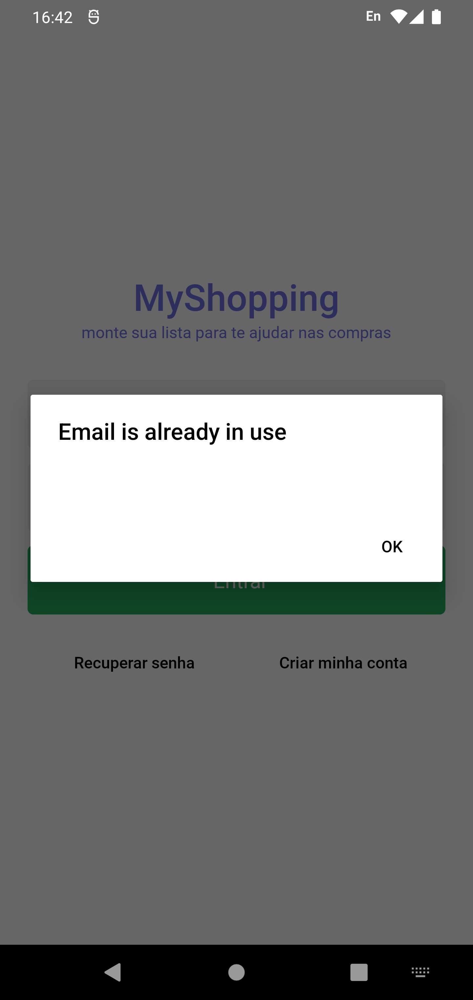 | 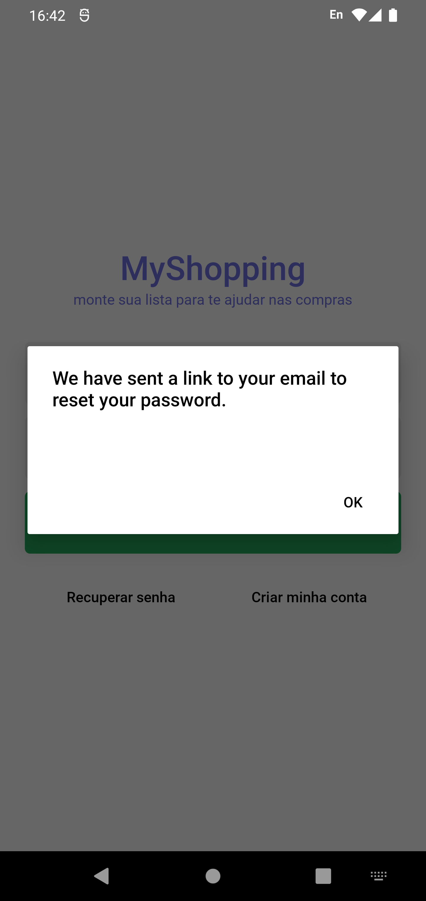 | 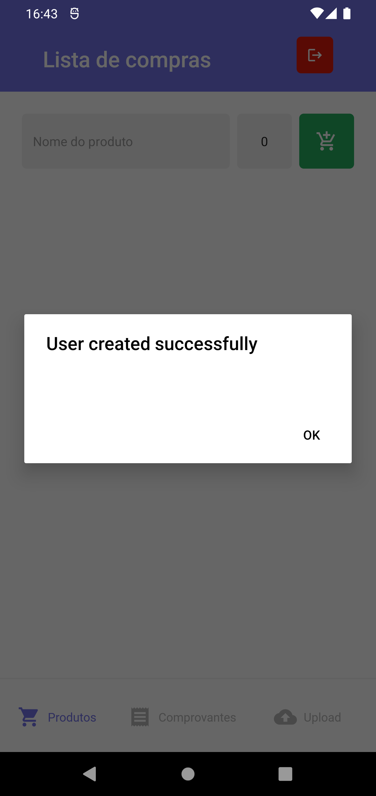 |

Após realizar login com sucesso, o usuário é direcionado para a home do aplicativo aonde poderá visualizar os itens cadastrados na sua lista de compras, cadastrar novos ou navegar para outras funcionalidades do app clicando nas opções presentes no menu inferior.

Para cadastrar um item basta informar o nome do produto e a quantidade à ser comprada e clicar no botão verde. Com isso o item já estará na lista e o usuário já poderá gerencia-lo ou adicionar novos itens. Na lista de itens, cada um deles possui dois botões no canto direito, onde:

- [x] Botão verde dá o item como comprando.
  - Com isso o item receberá um risco indicando que a quantidade previamente cadastrada já foi comprada.
  - Após o clique o ícone do botão irá mudar para indicar que a ação é reversível e o usuário pode reverter a sinalização de compra a qualquer momento.
- [x] Botão vermelho remove o item da lista.

|                          Lista de itens                           |                                 Lista de itens com itens comprados                                  |
| :---------------------------------------------------------------: | :-------------------------------------------------------------------------------------------------: |
|  | 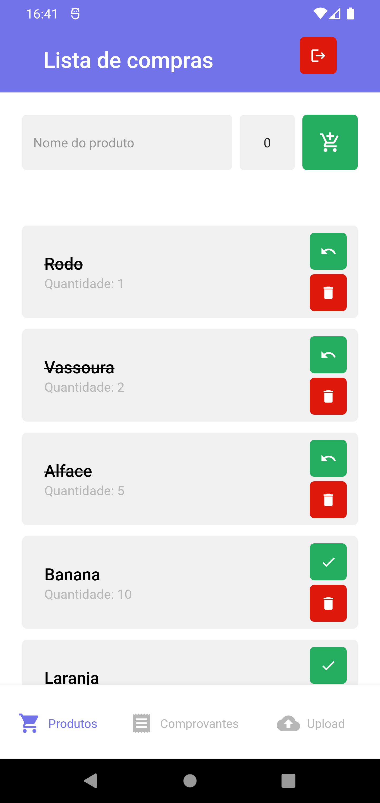 |

Agora que conhecemos a aba `Produtos`, vamos conhecer a aba seguinte: `Comprovantes`. Seu objetivo é centralizar e tornar acessíveis os comprovantes de compras cadastrados pelo usuário para eventuais consultas.
Nessa tela teremos as funcionalidades:

- [x] Listagem de comprovantes cadastrados.
- [x] Visualização de um comprovante.
  - Disponível através do clique no botão verde na parte direita do card dos comprovantes.
- [x] Exclusão de um comprovante.
  - Disponível através do clique no botão vermelho na parte direita do card dos comprovantes.

Para ilustrar cada uma dessas atividades deixo abaixo screenshots dessa parte da aplicação:

|                               Tela de comprovantes (vazia)                                |                            Tela de comprovantes                             |                                Visualização do comprovante                                 |                               Exclusão de um comprovante                                |
| :---------------------------------------------------------------------------------------: | :-------------------------------------------------------------------------: | :----------------------------------------------------------------------------------------: | :-------------------------------------------------------------------------------------: |
| 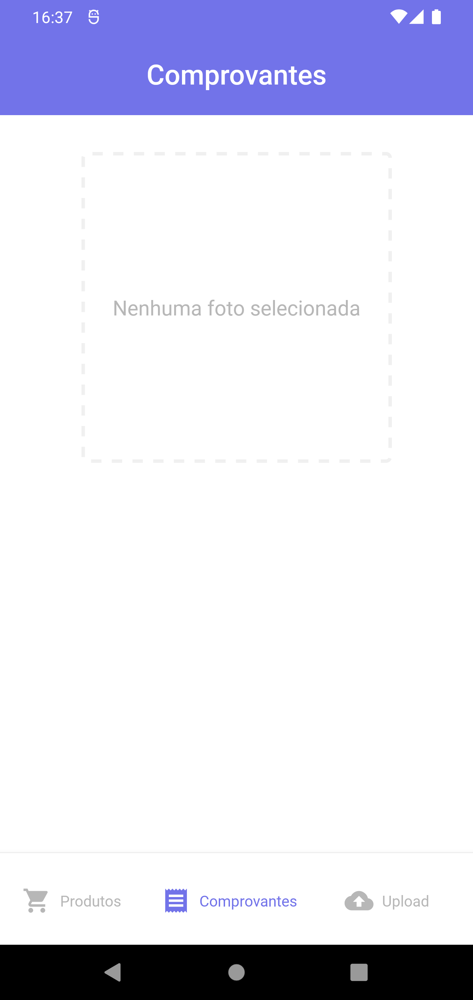 | 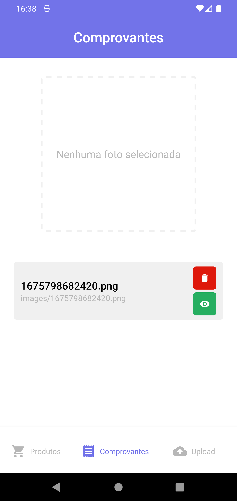 | 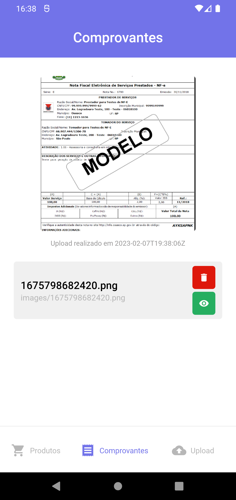 | 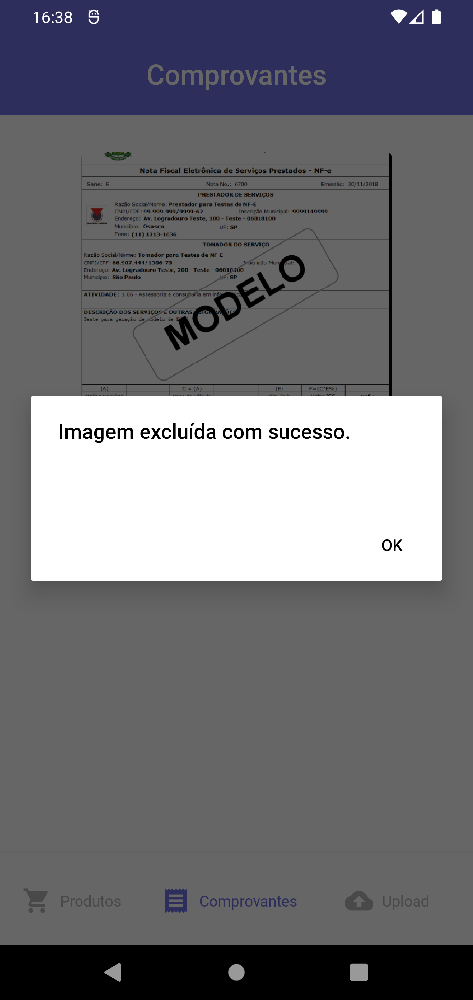 |

Agora que conhecemos a aba de comprovantes vamos a ultima aba da aplicação: `Upload`. Como o próprio nome sugere, é nessa página que o cadastro dos comprovantes ocorre. Aqui o fluxo é tão simples quanto:

1. Clicar no quadro pontilhado.
2. Selecionar a imagem do comprovante desejado.
3. Clicar no botão verde para fazer upload do comprovante.

|                           Tela de upload                            |                                   Comprovante selecionado                                   |                                   Mensagem upload concluído                                   |                               Upload Finalizado                               |
| :-----------------------------------------------------------------: | :-----------------------------------------------------------------------------------------: | :-------------------------------------------------------------------------------------------: | :---------------------------------------------------------------------------: |
| 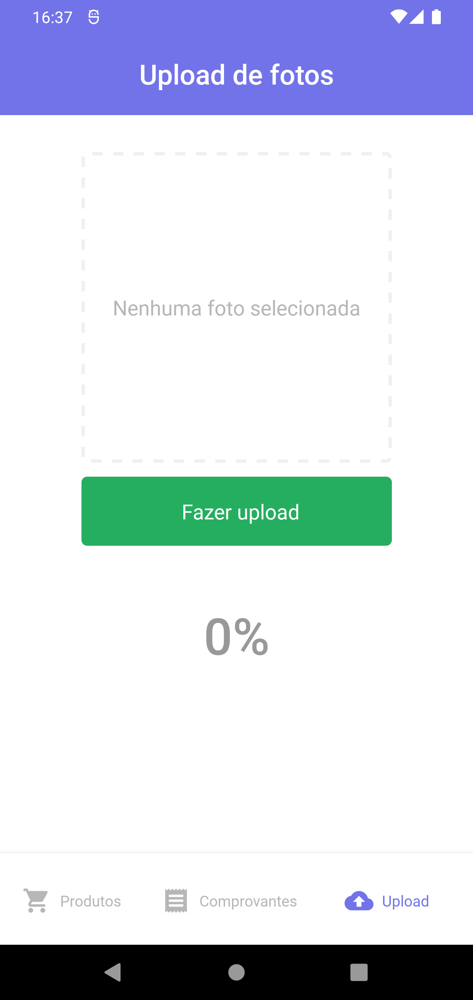 | 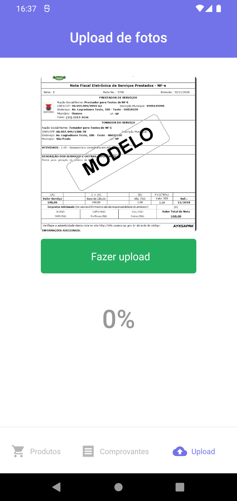 | 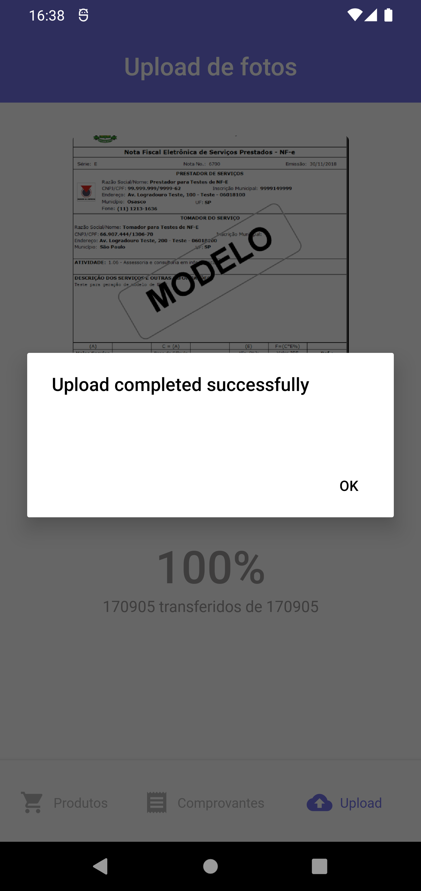 | 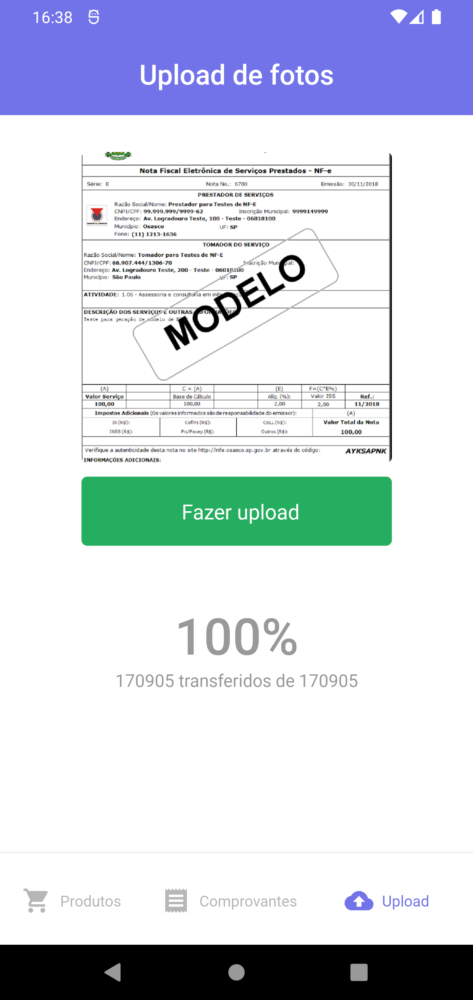 |

Afim de ilustrar tudo que foi explicado até aqui, deixo o GIF abaixo onde navego por toda a aplicação com o intuito de mostrar a aplicação em funcionamento:


## Instalação

Antes de começar, você vai precisar ter instalado em sua máquina as seguintes ferramentas:
[Git](https://git-scm.com) e [Node.js](https://nodejs.org/en/). Além disso é bom ter um editor para trabalhar com o código como [VSCode](https://code.visualstudio.com/).

### 📱 Rodando o App (Mobile)

```bash
# Clone este repositório
$ git clone git@github.com:MrRioja/myShop-ignite.git

# Acesse a pasta do projeto no terminal/cmd
$ cd myShop-ignite

# Instale as dependências
$ npm install
# Caso prefira usar o Yarn execute o comando abaixo
$ yarn

# Execute o bundle
$ npm run start
# Caso prefira usar o Yarn execute o comando abaixo
$ yarn start

# Abra o app no emulador android ou iOS
$ npm run [android | ios]
# Caso prefira usar o Yarn execute o comando abaixo
$ yarn [android | ios]
```

## Tecnologias

[](https://skillicons.dev)

## Autor

<div align="center">

<h1>Luiz Rioja</h1>
<strong>Backend Developer</strong>
<br/>
<br/>

<a href="https://linkedin.com/in/luizrioja" target="_blank">

</a>

<a href="https://github.com/mrrioja" target="_blank">

</a>

<a href="mailto:lulyrioja@gmail.com?subject=Fala%20Dev" target="_blank">

</a>

<a href="https://api.whatsapp.com/send?phone=5511933572652" target="_blank">

</a>

<a href="https://join.skype.com/invite/tvBbOq03j5Uu" target="_blank">

</a>

<br/>
<br/>
</div>
